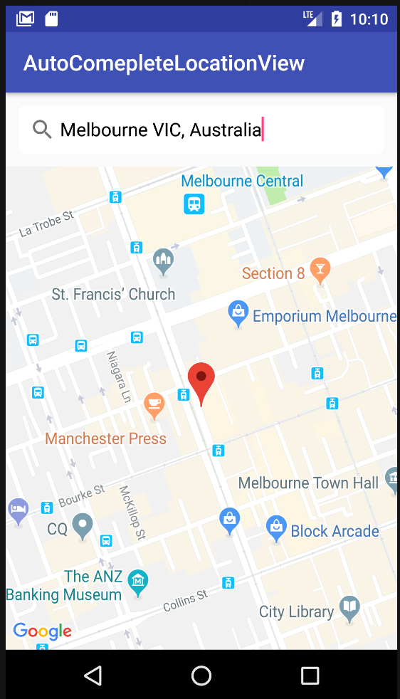
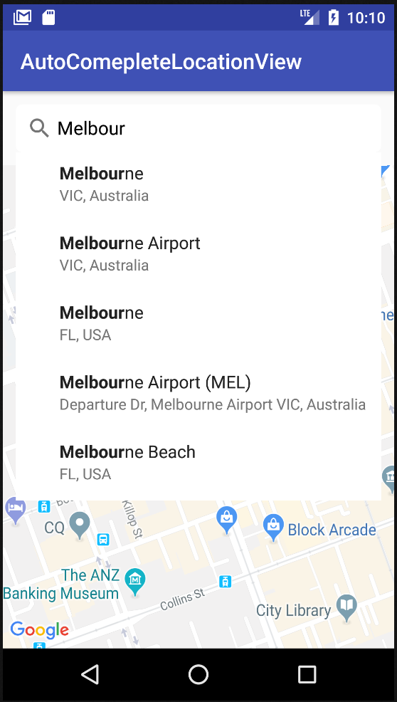
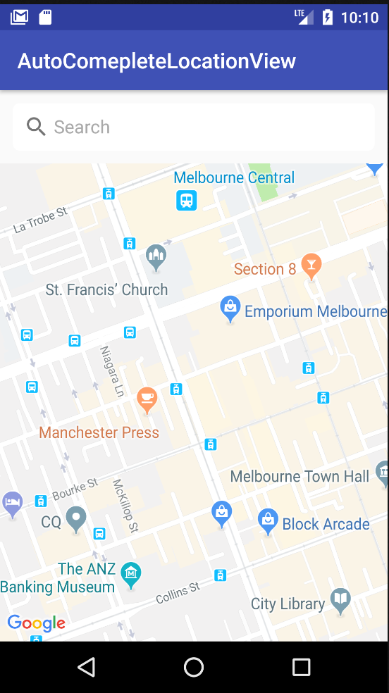

# CustomAutocompleteLocation
A library to implement PlaceAutocomplete in Android with custom view





#Native version
Maybe it would be useful to take a look into the new official approach
https://developers.google.com/places/android-api/autocomplete

# Usage
**Add the dependencies to your gradle file:**
```java
	dependencies {
    	  implementation 'com.github.pulse-id:CustomAutoCompleteLocation:-SNAPSHOT'
	}
```
**Get a Google Maps API Key and enabled the Google Places API for Android** *(Add your API Key in AndroidManifest)*:

```xml
    <meta-data
        android:name="com.google.android.geo.API_KEY"
        android:value="YOUR_API_KEY"
        />
```
**Add the AutocompleteLocation into the layout:**
```xml
  <com.jota.autocompletelocation.AutoCompleteLocation
      android:id="@+id/autocomplete_location"
      android:layout_width="match_parent"
      android:layout_height="wrap_content"
      />
```
**Set the listeners:**
```java
public class MainActivity extends Activity
   implements OnQueryCompleteListener{

  @Override protected void onCreate(Bundle savedInstanceState) {
    ...
    AutoCompleteLocation autoCompleteLocation =
        (AutoCompleteLocation) findViewById(R.id.autocomplete_location);
    autoCompleteLocation.setAutoCompleteTextListener(this);
  }
}
```
**Get the place:**
```java
@Override
   public void onTextClear() {
       map.clear();
   }

   @Override
   public void onPlaceSelected(Place selectedPlace) {
       map.clear();
       map.addMarker(new MarkerOptions().position(selectedPlace.getLatLng()));
       map.moveCamera(CameraUpdateFactory.newLatLngZoom(selectedPlace.getLatLng(), 16));
   }
```

  <com.shishank.autocompletelocationview.LocationAutoCompleteView
      android:id="@+id/autocomplete_view"
      android:layout_width="match_parent"
      android:layout_height="wrap_content"
      android:layout_gravity="center_horizontal"
      android:layout_margin="12dp"
      android:background="@drawable/white_bg"
      android:focusableInTouchMode="true"
      android:hint="@string/place_autocomplete_search_hint"
      android:paddingBottom="10dp"
      android:paddingLeft="10dp"
      android:paddingRight="10dp"
      android:paddingTop="10dp"
      android:textColor="#000000"
      android:textColorHint="@android:color/darker_gray"
      android:textSize="17sp" />
```

# Help me
Pull requests are more than welcome, help me and others improve this awesome library.

The code is based in the Place Autocomplete original concept.

